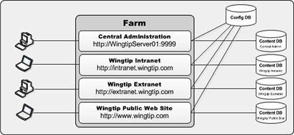
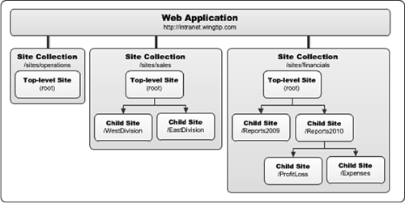
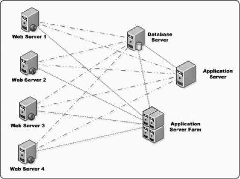

Modern Office 365, SharePoint & Cloud Development Ramp-Up
=========================================================
*Follow along at [github.com/andrewconnell/pres-modern-spdev-workshop](http://github.com/andrewconnell/pres-modern-spdev-workshop). This is just but one part of multiple parts that make up this workshop... [click here for all the parts that makeup this workshop](presentation.md).*

Part 1: Understanding SharePoint
================================
Terms you should be aware of...
- Farm
- Web Application
- Tenant / Tenancy
- Site Collection
- Site
- Administration / Management Options
  - Central Administration
  - Site Settings
  - Command line (Windows PowerShell)


Different Deployments & Hosting Options
---------------------------------------
*Briefly... more on these options in a moment.*
- On-Premises
- Cloud (Office 365)
- Hosted (FPWeb / Rackspace / Dell / etc)
- Hybrid


DEMO: Exploring SharePoint 2013
===============================
- Team site homepage
- Site Contents
- Site Pages
- Web Parts


SharePoint Farms
---------------------------------------
- One more more servers with SharePoint install & connected together
- Can be 1, 2 or * servers


SharePoint Web Application
--------------------------
- Based on IIS web site
- Defines 1+ URL endpoints
- *you'll never have to worry about these*




SharePoint Site Collections & Sites
-----------------------------------
- Site collections are logical things
  - Used to group sites together
  - Single administrator
  - All have a single top-level site with shared resources
- Sites are physical things
  - Browse to these things
  - Container of pages, lists, libraries & other sites
  - This is where the content resides




SharePoint Service Applications
-------------------------------
- Facilitates sharing resources
  - Content (taxonomies, search indexes)
  - Processing (search crawling, external data access)
- Some can (*and some cannot*) share across SharePoint farms




Administration Options
======================
- Central Administration
- Tenant Administration
- Site Settings
- Command Line


Central Administration
----------------------
- Available (*exclusively*) in on-premises deployments
- Central GUI administrative interface for a farm
- Create & manage service applications, web applications & site collections
- Maintain patch level, backup / restore
- Control farm-wide and server-wide settings


Tenant Administration
---------------------
- Similar to Central Administration, but scaled down to manage a specific tenant
- Central GUI administrative interface for a tenant
- Manage service application instances for the tenant
- Create & manage site collections in a tenant
- This is the most control you'll have in Office 365


Site Settings
-------------
- Dual use:
  - Site Collection administration
  - Site administration
- Site settings page for sites...
  - Manage site features
  - Users
  - Lists & libraries
  - Branding for a site (master pages & theme)
- Site settings page for site collection...
  - Extra section added when in top-level site
  - Site collection features
  - Search settings
  - Records management features


Command Line
------------
- All controlled via PowerShell
- Enables scripted tasks
- Some operations only available via PowerShell (*not via GUI*)
- Special SharePoint cmdlets added using a special PowerShell snapin:
````
PS C:\>Add-PSSnapIn Microsoft.SharePoint.PowerShell
````
- Special Office 365 administration cmdlets available ([extra download & install](http://technet.microsoft.com/en-us/library/hh974317.aspx))


SharePoint Deployment Options
=============================
- On-Premises (*aka: on-prem*)
  - Typically single-tenant
  - Manage using Central Administration / command line
  - Full access to all features
  - Deployed on your hardware, you manage everything
- Cloud (Office 365)
  - Microsoft deployed, hosted & managed
  - Pay per user license
  - Most features available
- Hosted
  - 3rd party deploys, hosts & manages for you
  - Like on-prem, but help in the day-to-day admin
  - Access to all on-prem features, but not O365 features
- Hybrid
  - On-premises & cloud instances linked together
  - Best of both worlds
  - Varies from customer - to - customer


SharePoint Customization / Development / Extensibility Options
==============================================================
- Depends on the audience
- Depends on the task / goal
- Tools available:
  - Browser
  - SharePoint Designer
  - Visual Studio


Audience: Power User
--------------------
- Browser
- SharePoint Designer
  - Rich-client for SharePoint
  - Workflow & external content type (BCS) designer


Audience: Developer
-------------------
- Visual Studio
- SharePoint Solutions
  - Introduced in SharePoint 2007
  - Updated in SharePoint 2010
  - De-emphasized in SharePoint 2013
- SharePoint App Model
  - Introduced in SharePoint 2013
  - Marketplace distribution model
  - Ideal for Office 365


DEMO: Key Components
====================
- Central Administration
- Site Settings
- IIS Web Sites
  - IIS
  - `c:\inetpub\wwwroot`
- `[..]\15`
- SQL Server databases


>#Resources
- [TechNet: Windows PowerShell cmdlets for Office 365 management and deployment](http://technet.microsoft.com/en-us/library/hh974317.aspx)
