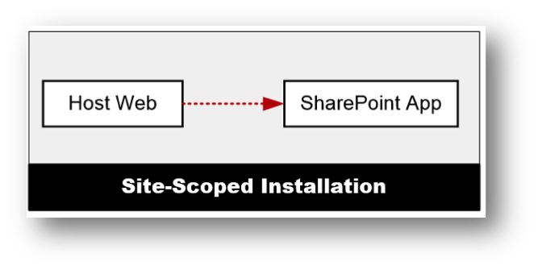

Modern Office 365, SharePoint & Cloud Development Ramp-Up
=========================================================
> *Follow along at [github.com / andrewconnell / pres-modern-spdev-workshop](http://github.com/andrewconnell/pres-modern-spdev-workshop). This is just but one part of multiple parts that make up this workshop... [click here for all the parts that makeup this workshop](presentation.md).*

Part 3: App Model-Based Development
===================================
1. [Introduction to SharePoint Apps](#introduction-to-sharepoint-apps)
1. [Developing SharePoint Apps](#developing-sharepoint-apps)
1. [Distribution and Deployment](#distribution-and-deployment)

+-+-+-+-+-+-+-+-+-+-+-+-+-+-+-+-+-+-+-+-+-+-+-+-+-+-+-+-+-+-+-+-+-+-+-+-+-+-+-+-+

Introduction to SharePoint Apps
===============================
- Why do we need apps?
- App model overview
- App installation scopes
- App glossary
- App types

Why do we need apps... what's wrong with solutions?
---------------------------------------------------
- Custom code...
  - Runs in the SharePoint process
  - Had dependencies on SharePoint DLLs
- Permission model based on user identity
- Hard to manage life-cycle
 

Overview of the SharePoint App Model
------------------------------------
- Apps work in Office 365 & on-premises SharePoint deployments
- Code in the SharePoint process prohibited
- Apps use client service endpoints to communicate with SharePoint
- Easy to manage life-cycle
- Facilitates a marketplace model
  - Public marketplace
  - App Catalog (*aka: company store*)

&laquo; **[back to top](#part-3-app-model-based-development)** &raquo;

Developing SharePoint Apps
==========================
- SharePoint hosted apps
- AppWeb, HostWeb & RemoteWeb
- App installation scope
- Cloud / provider hosted apps

SharePoint hosted apps
----------------------
- All parts of the app deployed to SharePoint
- Can't include any server-side code
- All business logic implemented in JavaScript
- Deployed to **AppWeb**
- Parent site is the **HostWeb**

DEMO: SharePoint Hosted App
---------------------------
- Create SharePoint hosted app in Visual Studio
- Deploy & examine

App terms
---------
- HostWeb
  - SharePoint site where the app was installed FROM
  - Parent site to the app
  - Anyone with permission to the HostWeb can access it's apps
- AppWeb
  - Special site where apps are installed
  - Highly isolated form all other SharePoint sites
  - Automatically created during app installation
  - Replaced during upgrade
- RemoveWeb
  - External web footprint for cloud / provider hosted apps
  - Must be manually creates & managed by developer / provider of app

App installation scopes
-----------------------
- Apps can be *scoped* to a site or the whole tenant
- To the end user, they show up & look the same
- Site scoped
  - Each install isolated from other installs of the same app
  - No sharing of data across installs  

- Tenant scoped
  - App installed in App Catalog
  - Made available in other across tenant, specific site collections, specific sites, etc

DEMO: Exploring the AppWeb
--------------------------
- Install SharePoint hosted app
- Explore differences between content site & AppWeb
- Examine parts of the AppWeb URL

Cloud hosted apps
-----------------
- Bulk of the app does not live in SharePoint
- It lives outside of SharePoint (aka: cloud)
- External site, **RemoteWeb**, can...
  - Reside anywhere: on-prem, Microsoft Azure, Amazon Web Services, etc.
  - Be implemented in any technology: .NET, Java, Node.js, PHP, Ruby, etc.
  - Be hosted on any infrastructure: IIS, Apache, Linux, etc.
- May have an **AppWeb**
  - *If establishing app identity, must have AppWeb*
- Parent site is the **HostWeb**

DEMO: Provider hosted app
-------------------------
- Create Provider hosted app in Visual Studio
- Deploy & examine

&laquo; **[back to top](#part-3-app-model-based-development)** &raquo;

Distribution and Deployment
===========================
- App packaging
- Publishing apps
- Upgrading apps

App packaging
-------------
- App packages are ZIPs
- Must contain: 
  - Manifest `AppManifest.xml` describing the app to SharePoint
  - Icon
- May contain:
  - Host web features
    - Custom UI Actions
    - App parts
  - `*.WSP` (sandboxed solution without `*.DLL`)

Publishing apps
---------------
- Publishing involves uploading to a catalog
- Catalog options:
  - Public: Office store
    - Supports selling apps
    - Similar to other marketplaces in review, verification, fees & compensation
  - Private to company: App catalog
    - Think *company store*
    - Special site collection
    - No review, verification or limitations
    - Available to everyone in the tenant

Upgrading apps
--------------
- Think how apps work on your phones and tablets
- Updates can never be pushed, they are only offered
- Installed apps indicate they can be updated

&laquo; **[back to top](#part-3-app-model-based-development)** &raquo;
